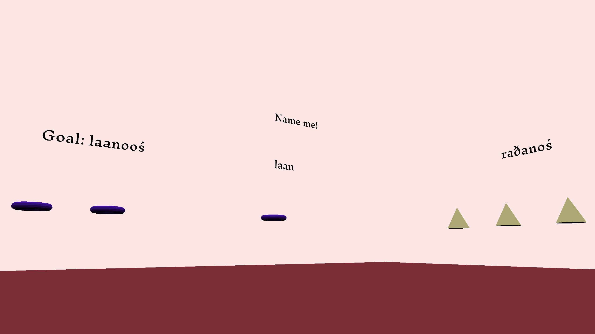

# A Simple Language Puzzle

Author: Russell Emerine

Design:
My game is a simple language puzzle where your
goal is to decipher the grammatical rules of a language.
The game gives you a visual representation of the information you have,
rather than telling it directly.

Text Drawing:
There is a program, [`render-glyphs.cpp`](render-glyphs.cpp),
that uses FreeType to produce a texture and some vertices for every glyph that
the font provides.
Those are stored in chunk formats,
the texture in its own format
and the vertices in the same format as any other `Mesh`.
The text is produced in the game by putting the rectangle
(actually two triangles) into the `Scene`'s list of `Drawable`s.
Glyphs are positioned from harfbuzz output.

Choices:
The original idea was for you to affect reality by
how you define words and grammar.
One way this could end up with branching options
is since certain types of linguistic characteristics
only work when certain others are present,
e.g. tone sandhi can only happen if there is tone.
However, this was an open-ended theme that I wasn't
able to make concrete in the time I had.
I had an interesting idea in the implementation
to author in Inform 7 and use its C API,
which could involve manually inserting extra
commands into the Inform 7 scripts,
or querying the Inform 7 object directly.
The interaction in this version of the game was just hardcoded.

Screen Shot:

How To Play:
Look around with the mouse.
If you want to get closer to something you can walk with the arrow keys
(but you will be stopped if you get too close).
Type to enter your guess for the word for a donut,
you will pass the level if you are correct.

Sources:

- Inknut Antiqua: https://fonts.google.com/specimen/Inknut+Antiqua?query=inknut
- I was considering using one of the Nuosu or Tifinagh fonts. The source would also be from Google Fonts.

Inspiration:

- Language puzzles of a more traditional format:
    - https://nacloweb.org/
    - https://ioling.org/
- Another language puzzle video game: https://en.wikipedia.org/wiki/Chants_of_Sennaar

This game was built with [NEST](NEST.md).

